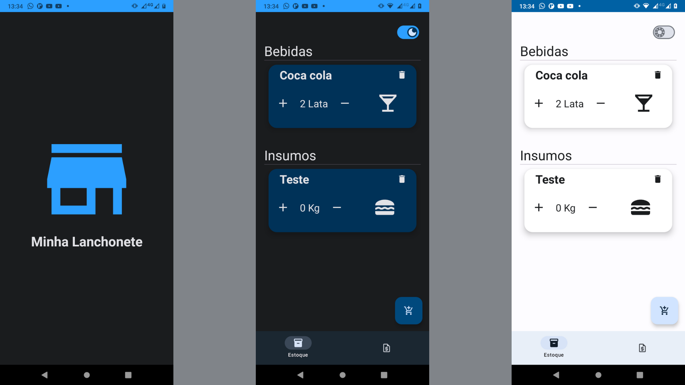
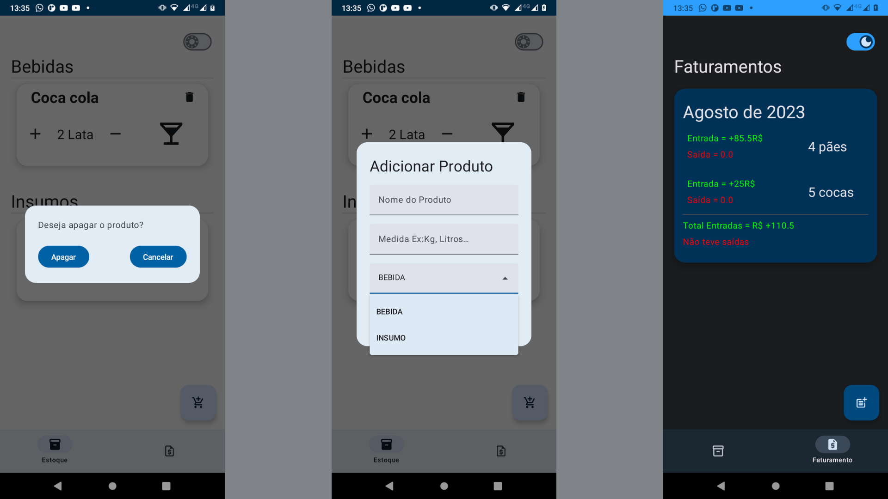
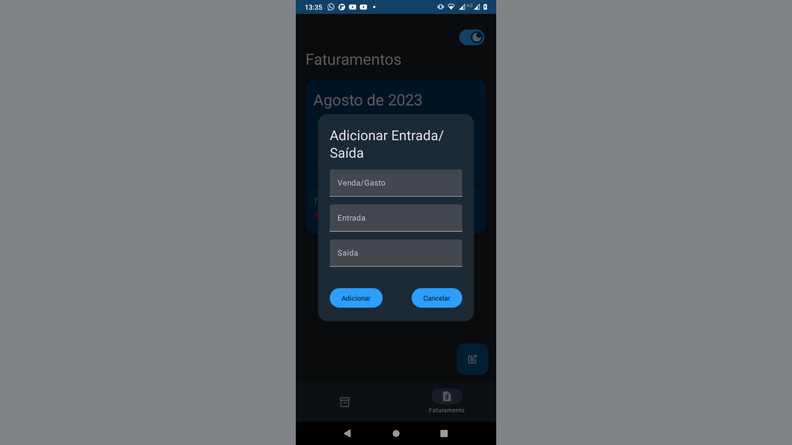

# Minha Lanchonete

## Sobre o Projeto

Projeto criado para gerenciar o seu estoque e o faturamento de entrada e saídas do caixa. Aplicativo
criado com Jetpack Compose com arquitetura MVVM e salvando os dados no próprio celular.

## Tecnologias Utilizadas

### Mobile

- Room Database
- Dagger
- Jetpack Compose
- Navigation

# Layout Mobile

